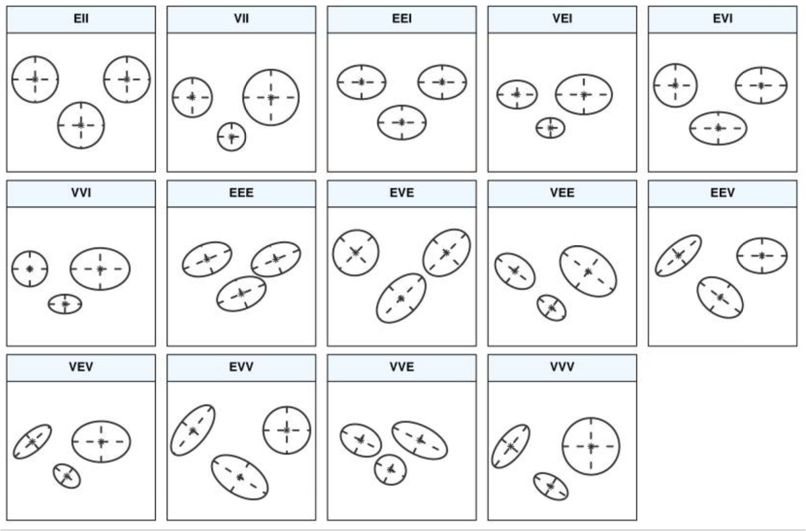

  
```{r setup, include=FALSE}
knitr::opts_chunk$set(echo = TRUE)
```

Delete all the possible objects of R that could have been left in memory:
```{r, include=TRUE}
rm(list = ls())
```

At first, let's load the libraries we'll need:

* *dplyr* and *ggplot2* will help us with data manipulation and graphs, respectively.
* *kableExtra* will help us to print beautiful tables.
* *gridExtra* for arranging the layout of the graphs.
* *stats* computes hierarchical cluster analysis on a set of dissimilarities and methods for analyzing it ( _hclust_).
* *cluster* to apply the _agnes_ (agglomerative hierarchical clustering) and the _diana_ (divisive hierarchical clustering).
* *gplots* computes heatmaps for visualizing the distance matrix.
* *factoextra* for MVA methods and graph the clustering structures.
* *FactoMineR* computes hierarchical clustering on principal components.

```{r message=FALSE,warning=FALSE}
library(dplyr)
library(ggplot2)
library(kableExtra)
library(gridExtra)
library(stats)
library(gplots)
library(cluster)
library(factoextra)
library(FactoMineR)
```

## Exploratory data analysis

The dataset we are going to analyze is about prostate cancer.
It consists of p=12 variables of mixed type (8 continuous and 4 
categorical) measured on a group of n=50 prostate cancer patients. These patients have either 
stage 3 or stage 4 prostate cancer.

Load the data from the R image 'Prostate.RData'.

```{r}
load("Prostate.RData")
```

Check dimension:

```{r}
dim(Prostate)
```

We have 50 rows and 12 columns

Check the structure:

```{r}
str(Prostate)
```


We can print a portion (a sample of 10) of the table using kable and the pipe operator:

```{r}
Prostate %>%
  sample_n(., 10, replace=FALSE) %>% 
  kbl(caption = "Phoneme data set (sample of 20)") %>%
  kable_classic(full_width = F, html_font = "Cambria")
```

Let's now visualize some basic statistics on each of the data frame's columns with *summary*:

```{r}
Prostate %>% 
  summary(.) %>% 
  kbl(caption = "Basic statistics. Cancer data set") %>%
  kable_classic(full_width = F, html_font = "Cambria")
```

Since clustering methods we analyzed work by considering a continuous domain, i.e. continuous varaibles, we'll remove the cageorical ones.
Another possibility could be to encode them in some numeric way, but we should take care of the distance measure to use in the hierarchial and k-means algorithms, which is difficutl to express in case of categorical variables.

Let's select only the numerical columns:

```{r}
library(purrr)
Prostate_reduced = Prostate[, c(1,2,5,6,8,9,10,11)]
```

Let's now check again the structure:

```{r}
str(Prostate_reduced)
```

And the dimensions:

```{r}
dim(Prostate_reduced)
```


### Check for missing values

Let's check for NA values:

```{r}
colSums((is.na((Prostate_reduced))))
```

There are no missing values!

### Outliers

One way to check for multivariate outliers is to use the [Malhanobis' distance](https://en.wikipedia.org/wiki/Mahalanobis_distance) . It can be thought of as a metric for estimating how far each observation is from the center of all the variables' distributions (i.e. the centroid in the multivariate space).

We'll use the *chemometrics* package, which contains a function ('Moutlier') for calculating and plotting both the "Mahalanobis'" distance and a robust version of the "Mahalanobis'" distance.

At first, let's calculate the "Mahalanobis'" distances using the 'Moutlier' function, to which we provide as parameters the numeric data frame, the quantile cutoff point beyond which we want to identify points as outliers, and whether or not we want a plot:

```{r}
#install.packages("chemometrics")
library(chemometrics)
md <- Moutlier(Prostate_reduced, quantile = 0.975, plot=FALSE)
```

The function returns the cutoff value for the outliers:

```{r}
md$cutoff
```

We simply use the 'which' function to identify which cases are outliers according to the 'cutoff' value and in this way we obtain the outliers' indexes:

```{r}
outliers <- which(md$md > md$cutoff)
head(outliers, 10) # show first 10 outliers according to Malhanobis distance
```

One way for identifying multivariate outliers (non-parametric approach) is to use the LOF ("local outlier factor") algorithm, which identifies density-based local outliers.

The algorithm we are going to use (from the package [DDoutlier](https://rdrr.io/cran/DDoutlier/man/LOF.html)) computes a local density for observations with a given k-nearest neighbors (we choose k = 5). This local density is compared to the density of the respective nearest neighbors, resulting in the local outlier factor.

Therefore, the function returns a vector of LOF scores for each observation: the greater the LOF, the greater the outlierness of the data point.

```{r}
#install.packages('DDoutlier')
library("DDoutlier")
lof <- LOF(Prostate_reduced, k = 5) # outlier score with a neighborhood of 5 points
```

We can show the lof scores for the 5 first observations:

```{r}
head(lof)
```

We can see and visualize the distribution of outlier scores:

```{r}
summary(lof) # some statistics
hist(lof)
```

It could be useful to plot also the sorted LOF scores:

```{r}
plot(sort(lof), type = "l",  main = "LOF (K = 5)",
  xlab = "Points sorted by LOF", ylab = "LOF")
```

Looks like outliers start around a LOF value of 2.0.

Let's show the indexes for 5 most outlying observations

```{r}
lof_with_names = lof
names(lof_with_names) <- 1:nrow(Prostate)
sort(lof_with_names, decreasing = TRUE)[1:5]
```

Let's first find the indexes of the outliers with a lof score above 2.0:

```{r}
outliers <- which(lof > 2.0)
```

Number of detected outliers:

```{r}
length(outliers)
```

```{r}
outliers
```
We will simply remove the found outliers (found with LOF) from the dataset, considering that we have more than 4k observations:

```{r}
Prostate_no_outliers = Prostate_reduced[-outliers,] 
```

Let's now check again the dimensions:

```{r}
dim(Prostate_no_outliers)
```

The outliers have been correctly removed!


### Check variables distribution

Check variables correlation:

```{r}
library(GGally)
ggpairs(Prostate_no_outliers,
        title="Correlation matrix. Phoneme data")
```

Let's now check the univariate distribution of each variable.

We'll use the density plot:

```{r}
library(gridExtra)
library(ggplot2)
g1 <- ggplot(Prostate_no_outliers, aes(x=age)) + geom_density(alpha=0.8)
g2 <- ggplot(Prostate_no_outliers, aes(x=wt)) + geom_density(alpha=0.8)
g3 <- ggplot(Prostate_no_outliers, aes(x=sbp)) + geom_density(alpha=0.8)
g4 <- ggplot(Prostate_no_outliers, aes(x=dbp)) + geom_density(alpha=0.8)
g5 <- ggplot(Prostate_no_outliers, aes(x=hg)) + geom_density(alpha=0.8)
g6 <- ggplot(Prostate_no_outliers, aes(x=sz)) + geom_density(alpha=0.8)
g7 <- ggplot(Prostate_no_outliers, aes(x=sg)) + geom_density(alpha=0.8)
g8 <- ggplot(Prostate_no_outliers, aes(x=ap)) + geom_density(alpha=0.8)

grid.arrange(g1,g2, nrow=1); grid.arrange(g3,g4,nrow=1);grid.arrange(g5,g6,nrow=1); grid.arrange(g7,g8,nrow=1)
```

A better approach for a visual inspection is the *Q-Q plot*, which shows the distribution of the data against the expected normal distribution. In particular, for normally distributed data, observations should lie approximately on a straight line. If the data is non-normal, the points form a curve that deviates markedly from a straight line. Let's perform such plot for each predictor, by using the library *ggpubr*:


```{r}
library(gridExtra)
library(ggpubr)
library(ggplot2)

g1 <- ggqqplot(Prostate_no_outliers, x="age", col=2, ggtheme = theme_gray(), title = "age Q-Q plot")
g2 <- ggqqplot(Prostate_no_outliers, x="wt", col=2, ggtheme = theme_gray(), title = "wt Q-Q plot")
g3 <- ggqqplot(Prostate_no_outliers, x="sbp", col=2, ggtheme = theme_gray(), title = "sbp Q-Q plot")
g4 <- ggqqplot(Prostate_no_outliers, x="dbp", col=2, ggtheme = theme_gray(), title = "dbp Q-Q plot")
g5 <- ggqqplot(Prostate_no_outliers, x="hg", col=2, ggtheme = theme_gray(), title = "hg Q-Q plot")
g6 <- ggqqplot(Prostate_no_outliers, x="sz", col=2, ggtheme = theme_gray(), title = "sz Q-Q plot")
g7 <- ggqqplot(Prostate_no_outliers, x="sg", col=2, ggtheme = theme_gray(), title = "sg Q-Q plot")
g8 <- ggqqplot(Prostate_no_outliers, x="ap", col=2, ggtheme = theme_gray(), title = "ap Q-Q plot")
grid.arrange(g1,g2, nrow=1); grid.arrange(g3,g4,nrow=1);grid.arrange(g5,g6,nrow=1); grid.arrange(g7,g8,nrow=1)

```

MODIFICAREEEEEEThe plots above clearly show that none of the predictors (except for the first one) follows a normal distribution, since the points do not fall along the reference line.

To have more precise insights, we can apply the normality [Shapiro-Wilk normality test](https://en.wikipedia.org/wiki/Shapiro%E2%80%93Wilk_test) to each predictor:

```{r}

print(shapiro.test(Prostate_no_outliers$age))
print(shapiro.test(Prostate_no_outliers$wt))
print(shapiro.test(Prostate_no_outliers$sbp))
print(shapiro.test(Prostate_no_outliers$dbp))
print(shapiro.test(Prostate_no_outliers$hg))
print(shapiro.test(Prostate_no_outliers$sz))
print(shapiro.test(Prostate_no_outliers$sg))
print(shapiro.test(Prostate_no_outliers$ap))

```

The low p-values (\<0.05) reject the null hypotheses for every variable (from x.1 to x.10), as we expected from the plots.


The clustering techniques are not limited to distance-based methods where we seek groups of statistical units that are unusually close to each other, in a geometrical sense. There are also a range of techniques relying on density (clusters are seen as "regions" in the feature space) or probability distribution.

The methods related to **distance-based methods** (e.g. hierarchical clustering & k-means) **has nothing to do with whether the variables** belong to some known distribution such as the **normal distribution**. For this reason we do not apply any transformation to change variables distributions.


#### Scaling

The **units** of the variables might have **an influence** in the clustering results. As we do not want the hierarchical clustering algorithm to depend on a variable with very large units and, therefore, the result of the clustering is dominated by a variable with large units, what is usually done is to **scale (standardize) each variable**.

```{r}
Prostate_no_outliers_sc <- Prostate_no_outliers %>%
        mutate_if(is.numeric, scale)
```

We can print a sample of the scaled table to see the new units:

```{r}
Prostate_no_outliers_sc %>%
  sample_n(., 10, replace=FALSE) %>% 
  kbl(caption = "Phoneme data set (sample of 20)") %>%
  kable_classic(full_width = F, html_font = "Cambria")
```

Let's print again the basic statistics:

```{r}
Prostate_no_outliers_sc %>% 
  summary(.) %>% 
  kbl(caption = "Basic statistics. Prostate data set") %>%
  kable_classic(full_width = F, html_font = "Cambria")
```

As we can see, we have now zero mean.


# Hierarchical clustering
In this section we are going to apply various hierarchical clustering methods that allow to draw dendrograms, and then we'll compare their results.

The first experiment that we are going to run is to differentiate agglomerative and divisive clustering:

* Agglomerative Clustering: also known as a bottom-up approach, starts with singletons and then agglomerates them based on their distances until having a group containing the whole set of elements.
* Divisive Clustering: also known as a top-down approach, starts with one group (or cluster) containing every element, then divides them using a splitting method until reaching singletons clusters.

An important parameter of the algorithm is the distance measure to apply for caclulating the distances between points. 
A further parameter is needed to calculate the distance between groups. We'll explore all of them in the following.

## Agglomerative hierarchical clustering
To experiment the agglomerative hierarchical clustering, we'll use the *agnes* (footnote: https://www.rdocumentation.org/packages/cluster/versions/2.1.2/topics/agnes) package (agglomerative nesting). 
We'll compute agglomerative hierarchial clustering using the euclidean distance for the points, while we'll compare 4 different approaches for what regards groups distances:
- Simple linkage
- Average linkage
- Complete linkage
- Ward criterion

Since *agnes* returns also the 'agglomerative coefficient', we'll compare the solutions obtained through the distance approaches we mentioned above using the agglomerative coefficient that the amount of clustering structure found (values closer to 1 suggest a strong clustering structure)

Let's compare the 4 appraches, by usign the euclidean distance among points:

```{r, include=TRUE}
# vector of methods to compare
m <- c("average", "single", "complete", "ward")
names(m) <- c( "average", "single", "complete", "ward")
 
# function to compute coefficient
ac <- function(x) {
  agnes(Prostate_no_outliers_sc, method = x)$ac
}
library(purrr)
map_dbl(m, ac)
```
TODO: LATEX TABLE OF AGGLO COEFS

Among the 4 distance computation methods, Ward's method gave us the highest agglomerative coefficient.
Therefore, we can inspect its dendrogram:

```{r, include=TRUE}
agnes.ward <- agnes(Prostate_no_outliers_sc, method = "ward")
agnes_dend <- agnes.ward %>% as.dendrogram
pltree(agnes.ward, cex = 0.6, hang = -1, main = "Dendrogram of agnes")
```
TODO: dendogram FIGURE

### Cutting the tree

In hierarchical clustering, we should decide where to cut the dendrogram, in order to obtain an actual asssignment of observations to clusters: this means that we should decide the optimal number of clusters.

We can do that with the function *cutree*
https://www.rdocumentation.org/packages/stats/versions/3.6.2/topics/cutree

_cutree_ cuts a tree, e.g., as resulting from hclust, diana, or agnes, into several groups either by specifying the desired number(s) of groups (k) or the cut height(s) (h).

One typical approach consists in cutting the tree where the branches are quite long: in the above dendrogram we can see that this happens at a height between 8 and 9, where we have 3 clusters. 
Let's then perform the cutting:

```{r, include=TRUE}
(clust <- cutree(agnes.ward, k = 3)) 
```

In order to graph those clusters, we can use the function *fviz_cluster* from the package _factorextra_
https://www.rdocumentation.org/packages/factoextra/versions/1.0.7/topics/fviz_cluster

```{r, include=TRUE}
fviz_cluster(list(data = Prostate_no_outliers_sc, cluster = clust))
```

We can also depict the clusters within the dendrogram in this way:

```{r, include=TRUE}
pltree(agnes.ward, hang=-1, cex = 0.6)
rect.hclust(agnes.ward, k = 3, border = 2:5)
```
## Divisive hierarchical clustering
After having performed hierarchical clustering using the agglomerative approach, it makes sense to apply the divisive option.
To do so we use the _diana_  algorithm.
The _diana_ function in the cluster package helps us to perform *divisive hierarchical groupings*. 
The function _diana_ works in a similar way to agnes.
However, there is *no method argument here*, and instead of the agglomerative coefficient, we have a division coefficient.


```{r, include=TRUE}
library(dendextend)
diana_dend <- diana(Prostate_no_outliers_sc) %>% as.dendrogram
diana_dend <- color_branches(diana_dend, k = 2)

```

We proceed now in computing the divisive coefficient.
A divisive coefficient (DC) closer to one suggests stronger group distinctions
The divisive coefficient is:

```{r, include=TRUE}
diana.hc <- diana(Prostate_no_outliers_sc)
diana.hc$dc
```
We obtain a value slightly lower than the agglomeration coefficient obtained with the agglomerative approach (0.8309064).

Finally, we plot of the dendogram:
```{r, include=TRUE}
pltree(diana.hc, cex = 0.6, hang = -1, main = "Dendrogram of diana")
```
### Cutting the tree

By looking at the length of the branches, the above dendrogram suggests to cut at a height around 6, which gives us 4 clusters.

Let's then perform the cutting:

```{r, include=TRUE}
(clust <- cutree(diana_dend, k = 4)) 
```

We can graph the clusters:

```{r, include=TRUE}
fviz_cluster(list(data = Prostate_no_outliers_sc, cluster = clust))
```
It seems that the 4th cluster is not well representative of a cluss of individuals: indeed it is formed only by 2 observation. 
We therefore re-perform the cutting with k=3: 


```{r, include=TRUE}
(clust <- cutree(diana_dend, k = 3)) 
```
We can graph the clusters:

```{r, include=TRUE}
fviz_cluster(list(data = Prostate_no_outliers_sc, cluster = clust))
```

The plots seems now much more consistent, with a small overlapping between clusters 2 and 3.

We can also depict the clusters within the dendrogram in this way:

```{r, include=TRUE}
pltree(diana.hc, hang=-1, cex = 0.6)
rect.hclust(diana.hc, k = 3, border = 2:5)
```


## Comparing agglomerative and divisive methods
We can compare the partitions obtained throught the two approaches by using a _tanglegram_ which makes us able to compare the two dendograms by drawing links between them.

```{r, include=TRUE}
library(dendextend)
diana_dend <- diana.hc %>% as.dendrogram
tanglegram(agnes_dend, diana_dend)
```
A better way to visualize the differences among the partitions obtained with the 2 algorithms, is to visualize the 2 dendrograms one below the other:

```{r}
pltree(agnes.ward, hang=-1, cex = 0.6)
rect.hclust(agnes.ward, k = 3, border = 2:5)

pltree(diana.hc, hang=-1, cex = 0.6)
rect.hclust(diana.hc, k = 3, border = 2:5)
```
The 3 clusters are slighlty different between the methods: for instance we can see that the 'green' cluster is bigger in 'diana' with respect to 'agnes'.


## Hierarchical clustering on principal components using _HCPC_

Another approach consists in applying firstly a PCA to the continuous dataset, and then a clustering method to the obtained reduced representation.

In this approach, the PCA step can be considered as a denoising step which can lead to a more stable clustering. This might be useful in our case since we are doing clustering by considering 8 variables.

The algorithm of the HCPC method, as implemented in the _FactoMineR_ package, can be summarized as follow:

1. _Compute PCA_: we retain 3 dimensions

```{r, include=TRUE}
res.pca <- PCA(Prostate_no_outliers_sc, ncp = 3, graph = FALSE)
fviz_pca_biplot(res.pca) +
       theme_minimal()
```

2. _Compute hierarchical clustering_: Hierarchical clustering is performed using the Ward's criterion on the selected principal components. Ward criterion is used in the hierarchical clustering because it is based on the multidimensional variance like principal component analysis.

```{r, include=TRUE}
res.hcpc <- HCPC(res.pca, graph = FALSE)
```

The function _HCPC_ returns a list containing:

* *data.clust*: The original data with a supplementary column called class containing the partition.
* *desc.var*: The variables describing clusters
* *desc.ind*: The more typical individuals of each cluster
* *desc.axes*: The axes describing clusters

Therefore, the *HCPC* function already performs an initial partitioning. 
We can know the number of clusters typing this:
```{r, include=TRUE}
unique(res.hcpc$data.clust$clust)
```
The method returns the same number of clusters we found with the previous approaches.

Thus, let's display the original data with cluster assignments:
```{r, include=TRUE}
res.hcpc$data.clust %>%
  sample_n(., 10, replace=FALSE) %>% 
  kbl(caption = "Cluster allocation (sample of 10)") %>%
  kable_classic(full_width = F, html_font = "Cambria")
```
In the table above, the last column contains the cluster assignments.

To display quantitative variables that describe the most each cluster:
```{r, include=TRUE}
res.hcpc$desc.var$quanti
```

Let's focus on columns "Mean in category" (the average within the corresponding group), "Overall Mean" (the overall mean in the data set), "p.value" (<0.05 means that there is significant difference between Overall mean and the mean within the corresponding group)

From the output above, it can be seen that:

* Cluster 1 is characterized by positive values of variables 'ap', 'sg', 'sz';
* For what regard cluster 2, we have pretty high p-values with respect to the other clusters, but still we have p-values < 5% and therefore we can draw some conclusions. What we can say is that this cluster is characterized by negative (standardized) values of each one of the variables: for instance, with respect to cluster 1, in cluster 2 the variable 'sz' has a mean in the category of -0.37, while we have a positive value of the mean for the same variable on cluster 1. The same reasoning can be applied for the other variables variables 
* Cluster 3 has, on overall positive values for the varaible 'dbp' (which has negative mean in cluster 1 and 2); it has also positive value for variable 'sbp', which is also significant for cluster 2 where it has a negative mean. Also variable 'hg' has positive value in this cluster, and it's also significant in cluster 2 with negative mean value. Varaible 'wt' has also positive value in this cluster. So, overall cluster 3 is characterize by positive mean values (standardized) of the variables 'dbp', 'sbp', 'hg', 'wt'.


To show principal dimensions that are the most associated with clusters:
```{r, include=TRUE}
res.hcpc$desc.axes$quanti
```

The above output indicates that:
* individuals in cluster 1 have high coordinates on axes 1 and negative ones on axes 2
* individuals in cluster 2 have negative coordinates on axes 2
* individuals in cluster 3 have positive coordinates on axes 1 and 2

Representative individuals of each cluster can be extracted as follows:
```{r, include=TRUE}
res.hcpc$desc.ind$para
```
For each cluster, the top 5 closest individuals to the cluster center is shown. The distance between each individual and the cluster center is provided. For example, representative individuals for cluster 1 include individuals number 41, 8, 5, 32, 31

To visualize the dendrogram generated by the hierarchical clustering, we use the function _fviz_dend_ ( _factoextra_ package):
```{r, include=TRUE}
fviz_dend(res.hcpc, 
          cex = 0.7,            # Label size
          palette = "jco",      # Color palette 
          rect = TRUE, 
          rect_fill = TRUE, # Add rectangle around groups
          rect_border = "jco",           # Rectangle color
          labels_track_height = 0.8   # Increase the room for labels
          )
```

As we did above, it is possible to visualize individuals on the principal component map and to color individuals according to the cluster they belong to. The function _fviz_cluster_ (package _factoextra_) can be used to visualize individuals clusters.

```{r, include=TRUE}
fviz_cluster(res.hcpc,
             repel = TRUE,            # Avoid label overlapping
             show.clust.cent = TRUE, # Show cluster centers
             palette = "jco",     # Color palette see 
             ggtheme = theme_minimal(),
             main = "Factor map"
             )
```
What we can see from the above plot is that the HCPC method performs a quite good separation of the individuals on 3 clusters, which is perfectly described by the first factorial plane.


We can also combine PCA and tree and depict a 3D plot combining the hierarchical clustering and the factorial map using the R base function _plot_

```{r, include=TRUE}
plot(res.hcpc, choice = "3D.map")
```


# Partitioning clustering: k-means

Let's now focus on the most famous partitioning clustering algorithm: k-means. It's a stable algorithm based on moving averages where, at each steps, elements are gathered into the closest group (in terms of Euclidean distance for example). An example of k-means clustering plots can be found in Figure TODO.

Because the algorithm is based on arbitrary starting centroids, we will run it multiple times in order to make the most generalist conclusions possible about our data. \\

To compute this algorithm, we will use the function *kmeans* from the R package _stats_ \footnote{https://www.rdocumentation.org/packages/stats/versions/3.6.2/topics/kmeans}.

## Finding the number of clusters
In order to have the most relevant method, we first need to find the optimal number of clusters (which is the number of centroids we will start with). We will use various methods:
* Elbow method: Based on a plot of the within-cluster sum of squares (wss) and then identify the optimal number of clusters (or centers) at the bend (called elbow) on the plot
* Silhouette method: Based on how well each object lies within a cluster 
* Gap statistic method: based on null hypothesis, compares the total within-cluster variation using different k values on various samples of the data, using bootstrapping.

```{r, include=TRUE}
set.seed(67600)
```

The Elbow method for k-means (look at the knee)
```{r, include=TRUE}
fviz_nbclust(Prostate_no_outliers_sc, kmeans, method = "wss") +
geom_vline(xintercept = 2, linetype = 2)
```

The average silhouette for k-means
```{r, include=TRUE}
fviz_nbclust(Prostate_no_outliers_sc, kmeans, method = "silhouette")
```
Gap statistics:

```{r, include=TRUE}
# we used B = ~500
gap_stat <- clusGap(Prostate_no_outliers_sc, FUN = kmeans, 
                    nstart = 25, K.max = 10, B = 500)
fviz_gap_stat(gap_stat)
```


A more robust way could be to use the R package and function _NBclust_, which provides 30 indexes for determining the number of clusters and proposes to user the best clustering scheme from the different results obtained by varying all combinations of number of clusters, distance measures, and clustering methods.


https://www.rdocumentation.org/packages/NbClust/versions/3.0/topics/NbClust

```{r, include=TRUE}
library(NbClust)
nc <- NbClust(Prostate_no_outliers_sc, min.nc=2, max.nc=10, method="kmeans")
```

We'll show the clusters for k=2 and k=3, which is the optimal value suggested by _NBclust_

```{r, include=TRUE}
k2 <- kmeans(Prostate_no_outliers_sc, centers = 2, nstart = 25)
k3 <- kmeans(Prostate_no_outliers_sc, centers = 3, nstart = 25)
```

We create the graphs side-by-side:

```{r, include=TRUE}
p1 <- fviz_cluster(k2, geom = "point", data = Prostate_no_outliers_sc) + ggtitle("k = 2")
p2 <- fviz_cluster(k3, geom = "point",  data = Prostate_no_outliers_sc) + ggtitle("k = 3")

grid.arrange(p1, p2, nrow = 1)
```
From the plot above, we can graphically visualize the 2 explored case and it is clearly visible that the case with k=2 better separates the observations, without any overlapping.


Since most of the methods suggested the case with k=3 (which is also the value we obtained in the hierarchical algorithms), let's do some more in-depth analysis to understand the meaning of the obtained clusters.

We can compute the mean of each variables by cluster using the original data

```{r, include=TRUE}
aggregate(Prostate_no_outliers_sc, by=list(cluster=k3$cluster), mean) %>% 
    kbl(caption = "Mean by group and by variable") %>%
  kable_classic(full_width = F, html_font = "Cambria")
```

From the above table we can see the following:
* Cluster 1 contains observations with (on average) negtive values along all the variables
* Cluster 2 has positive averages for each variable, except for the last 3
* Cluster 3 contains elements characterized by high values of the variables 'sz', 'sg' and 'ap'


Let's check the cluster size
```{r, include=TRUE}
k3$size
```

and the graph:

```{r, include=TRUE}
fviz_cluster(k3,  data = Prostate_no_outliers_sc) + ggtitle("k = 3")
```


# Hierarchical K-Means Clustering

K-means, as we know, is very sensitive to the initial choices made regarding the number of clusters we want to find and to the initial positioning of the centroids.
Therefore, one possible improvement that can be made is to integrate a hierarchical clustering approach in the initial stage of the k-means algorithm, to better initialize the centroids when applying k-means.
This is what the hierarchical k-means clustering algorithm does, allowing to obtain more robust clusters with respect to the classical k-means.

Let's apply the algorithm:

```{r, include=TRUE}
res.hk <-hkmeans(Prostate_no_outliers_sc,3)
```

Print the results
```{r, include=TRUE}
res.hk
```

Visualize the dendrogram
```{r, include=TRUE}
fviz_dend(res.hk, cex = 0.6, palette = "jco", 
          rect = TRUE, rect_border = "jco", rect_fill = TRUE)
```

Visualize the hkmeans final clusters
```{r, include=TRUE}
fviz_cluster(res.hk, palette = "jco", repel = TRUE,
             ggtheme = theme_classic())
```


# INTERPRETATION AND COMMENTS WITH RESULTS OF CLASSICAL KMEANS
Let's visualize one beside the other the results of k-means and the hierarchical k-means we just performed, to visualize the eventual differences:

```{r}
g1 <- fviz_cluster(k3,  data = Prostate_no_outliers_sc, palette = "jco")
g2 <- fviz_cluster(res.hk, palette = "jco", repel = TRUE)
grid.arrange(g1, g2)
```

The plot shows that the introduction of the hierachical clustering initialization in the k-means improves the separation between the clusters, already found with classical k-means. Indeed the 3 groups are more separated in the 2nd case.

# Model-based clustering

In model-based clustering, the data is considered as coming from a mixture of distributions (i.e. mixture models). 

In our case, we consider a Gaussian mixture models, where each component k in the model can be considered as cluster and is modeled by the normal or Gaussian distribution which is characterized by the parameters:

* mean vector $\mu_k$
* covariance matrix $\Sigma_k$
* an associated probability in the mixture. Each point has a probability of belonging to each cluster. $\pi_g$

Since we are using the COVARIANCE MATRIX, it is NOT REQUIRED to do a standardization, but we'll use the standardized data to be able to compare the results of the different algorithms.


At first, let's load the MASS package:
```{r message=FALSE,warning=FALSE}
library(MASS)
```

The Rpackage *mclust* performs Model-based clustering based on parameterized finite Gaussian mixture models. In particular, models are estimated by EM algorithm initialized by hierarchical model-based agglomerative clustering. The optimal model is then selected according to the BIC criteria: A large BIC score indicates strong evidence for the corresponding model.
The function we'll use denotes the model with a character string composed by 3 characters indicating the characteristics of the model at which the optimal BIC occurs: 
* the first character refers to volume
* the second to shape
* the thirs to orientation

In details: E stands for "equal", V for "variable" and I for "coordinate axes".

Remember the options of shape, volume, orientation of the cluster from R package mclust:


For example:

* EVI denotes a model in which the volumes of all clusters are equal (E), the shapes of the clusters may vary (V), and the orientation is the identity (I) or “coordinate axes.
* EEE means that the clusters have the same volume, shape and orientation in p-dimensional space.
* VEI means that the clusters have variable volume, the same shape and orientation equal to coordinate axes.


Let's fit the model-based clustering by using the 'Mclust' function:
https://www.rdocumentation.org/packages/mclust/versions/5.4.7/topics/Mclust

```{r, include=TRUE}
library(mclust)
```

```{r, include=TRUE}
mc <- Mclust(Prostate_no_outliers_sc)
summary(mc) # Print a summary
```

The lowest the BIC, the better the model fits to the data.
For this data, it can be seen that model-based clustering selected a model with 2 components (i.e. clusters). The optimal selected model name is VVI model. 


That is the 4 components are ellipsoidal with varying volume, varying shape and the orientation is the identity (I) or "coordinate axes'". 

The summary contains also the clustering table specifying the number of observations in each clusters: in this case we have 28 observation in the 1st cluster and 18 in the 2nd


Let's now access the results provided by the *mclust* function:

1. Optimal selected model
```{r, include=TRUE}
mc$modelName     
```
2. Optimal number of cluster 
```{r, include=TRUE}
mc$G     
```
3. Probability to belong to a given cluster 
```{r, include=TRUE}
mc$z  %>%
    as.data.frame(.) %>% 
  sample_n(., 10, replace=FALSE) %>% 
  kbl(caption = "Probability to belong to a given cluster (sample of 10)") %>%
  kable_classic(full_width = F, html_font = "Cambria")
```

We now that model-based clustering is a soft-clustering technique: therefore we have, for eah sample, a probability to belong to each one of the clusters.
The above table, shows that for this sample of data, the assignment of points to clusters is pretty straightforward, since we have high probabilities for each observation.

4. Cluster allocation of each observation
```{r, include=TRUE}                    
head(mc$classification,10)
```

Model-based clustering results *can be drawn* using the base function _plot.Mclust_ in *mclust* package, which gives plots for model-based clustering results, such as _BIC_, _classification_, and _uncertainty_.

https://www.rdocumentation.org/packages/mclust/versions/5.4.7/topics/plot.Mclust

BIC: plot of BIC values used for choosing the number of clusters.
```{r, include=TRUE}
plot.Mclust(mc, what="BIC")
``` 

From *mclust*, we can obtain the top BIC ranking:
```{r, include=TRUE}
summary(mc$BIC)
```

Classification:a plot showing the clustering. Ellipses corresponding to covariances of mixture components are also drawn if _addEllipses = TRUE_.
```{r, include=TRUE}
plot.Mclust(mc, what="classification", addEllipses = FALSE)
``` 

With drawn ellipses:
```{r, include=TRUE}
plot.Mclust(mc, what="classification", addEllipses = TRUE)
``` 

Uncertainty: a plot of classification uncertainty
```{r, include=TRUE}
plot.Mclust(mc, what="uncertainty")
``` 


Note that, in the uncertainty plot, _larger symbols indicate the more uncertain observations_.

Density: plot of estimated density
```{r, include=TRUE}
plot.Mclust(mc, what="density", type = "image", col="steelblue", grid = 200)
```

```{r, include=TRUE}
plot.Mclust(mc, what="density", type="persp")
```
The density estimation only shows three clusters.

Let's improve a bit those graphs using the *factoextra* package, which are more beautiful as they are based on _ggplot2_

Let's graph the *BIC values* used for choosing the number of clusters
```{r, include=TRUE}
library(factoextra)
fviz_mclust(mc, "BIC", palette = "jco")
```

In this graph, we can draw only the model that we are interested in using the function *fviz_mclust_bic*:
```{r, include=TRUE}
library(factoextra)
fviz_mclust_bic(mc, model.names=mc$modelName, palette = "jco")
```


Classification: plot showing the clustering
```{r, include=TRUE}
fviz_mclust(mc, "classification", geom = "point", 
            pointsize = 1.5, palette = "jco")
```

Classification uncertainty
```{r, include=TRUE}
fviz_mclust(mc, "uncertainty", palette = "jco")
```

Let's remember the number of objects by group:
```{r, include=TRUE}
table(mc$classification)
```
We can consider that the cluster 2 is too small (only 17 objects). Thus, we can force the number of clusters (in this case G=3)
```{r, include=TRUE}
mc.G3 <- Mclust(geyser.sc, G=3)
summary(mc.G3) # Print a summary
```


```{r, include=TRUE}
fviz_mclust(mc.G3, "classification", geom = "point", 
            pointsize = 1.5, palette = "jco")
```

In this example, we have only used two variables/predictors "waiting" and "duration". What would it happen if we use more than two predictors? Let's see it quickly with an example 

Let's use *the diabetes data set* in _mclust_ package, which gives three measurements and the diagnosis for 145 subjects described as follows:
```{r, include=TRUE}
library("mclust")
data("diabetes")
diabetes %>% 
  sample_n(., 10, replace=FALSE) %>% 
  kbl(caption = "Diabetes data set (sample of 10)") %>%
  kable_classic(full_width = F, html_font = "Cambria")
```
The variables are:

* class: the diagnosis: normal, chemically diabetic, and overtly diabetic. Excluded from the cluster analysis.
* glucose: plasma glucose response to oral glucose
* insulin: plasma insulin response to oral glucose
* sspg: steady-state plasma glucose (measures insulin resistance)

Let's run the model-based clustering
```{r, include=TRUE}
library("mclust")
df <- scale(diabetes[, -1]) # Standardize the data. We remove "class"
mc2 <- Mclust(df)            # Model-based-clustering
summary(mc2)                 # Print a summary
```

For this data, it can be seen that model-based clustering selected a model with *three components* (i.e. clusters). The optimal selected model name is *VVV model*. That is the three components are ellipsoidal with varying volume, shape, and orientation. The summary contains also the clustering table specifying the number of observations in each clusters.


In the situation, where the data *contain more than two variables*, fviz_mclust() uses a *principal component analysis* to reduce the dimensionality of the data. 
The first two principal components are used to produce a scatter plot of the data. 

```{r, include=TRUE}
# BIC values used for choosing the number of clusters
fviz_mclust_bic(mc2, model.names=mc2$modelName, palette = "jco")
# Classification: plot showing the clustering
fviz_mclust(mc2, "classification", geom = "point", 
            pointsize = 1.5, palette = "jco")
# Classification uncertainty
fviz_mclust(mc2, "uncertainty", palette = "jco")
```

However, if you want to plot the data using only two variables of interest, let say here c("insulin", "sspg"), you can specify that in the fviz_mclust() function using the argument _choose.vars = c("insulin", "sspg")_.

```{r, include=TRUE}
# Classification: plot showing the clustering
fviz_mclust(mc2, "classification", geom = "point", 
            pointsize = 1.5, palette = "jco", 
            choose.vars = c("insulin", "sspg"))
```

As we have the class ( _diabetes$class_) in this example, we can see the accuracy of the clusters to the class
The fitted model provides an accurate recovery of the true classes:

```{r, include=TRUE}
table(diabetes$class)
#Confusion matrix
table(diabetes$class, mc2$classification)
```

You can observe the "label switching" problem
```{r, include=TRUE}
mc2$classification[which(mc2$classification==2)] <- 4
mc2$classification[which(mc2$classification==1)] <- 2
mc2$classification[which(mc2$classification==4)] <- 1
table(diabetes$class, mc2$classification)
```

The accuracy is:
```{r, include=TRUE}
sum(diag(table(diabetes$class, mc2$classification)))/sum(table(diabetes$class, mc2$classification))
```

We can also evaluate a clustering solution with the Adjusted Rand Index (ARI). 
The ARI is a measure of agreement between two partitions, one estimated by a statistical procedure independent of the labeling of the groups, and one being the true classification. It has zero expected value in the case of a random partition, and it is bounded above by 1, with *higher values representing better partition accuracy*. 
```{r, include=TRUE}
adjustedRandIndex(diabetes$class, mc2$classification)
```

We can also use another dimension reduction with the function *MclustDR*, which implements the methodology introduced in Scrucca (2010) (https://arxiv.org/pdf/1508.01713.pdf). The estimated directions which span the reduced subspace are defined as a set of *linear combinations of the original features, ordered by importance as quantified by the associated eigenvalues*.
Thus, we apply *MclustDR*

```{r, include=TRUE}
drmc2 <- MclustDR(mc2, lambda = 1)
summary(drmc2)
```

The plot would be
```{r, include=TRUE}
plot(drmc2, what = "contour")
```

On the same subspace we can also plot the uncertainty boundaries corresponding to the classification:
```{r, include=TRUE}
plot(drmc2, what = "boundaries", ngrid = 200)
```


Finally, I recommend to save an image of all objects created in the session.
```{r, include=TRUE}
save.image(file="R_Example_Clustering.RData")
```